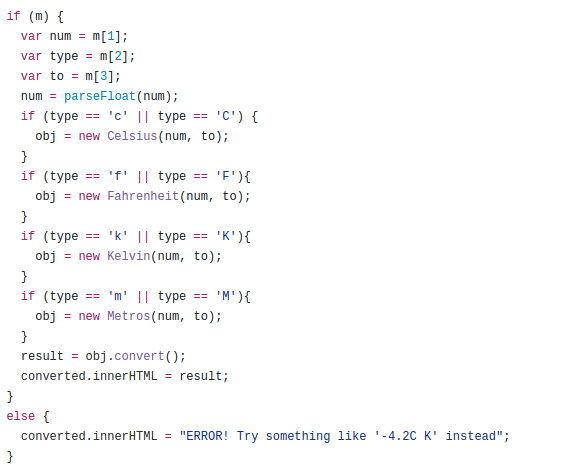
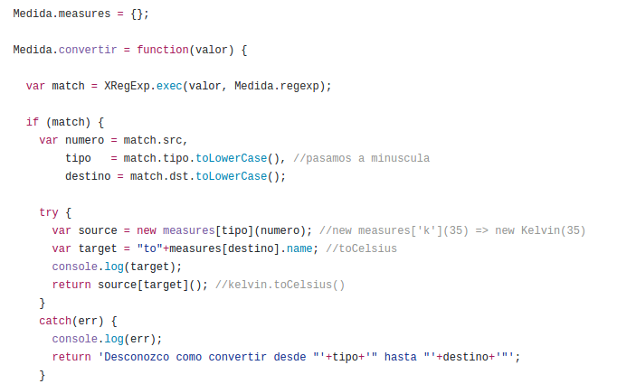

# ETSII ULL Grado de Informatica

## Práctica 7: Conversor en JavaScript de temperaturas y metros: Eliminando Switch Smell

Ésta práctica consiste en la modificación del código javascript que simula un conversor de temperaturas, de tal forma que el código se estructure en varios ficheros y con nivel escalable, es decir, que si en un futuro se le añaden más opciones de conversión, no sea necesario cambiar el programa principal. A continuación podemos ver el llamado switch smell que impide que nuestro conversor sea escalable:



Para solucionar esto, hemos tenido que seguir Strategy Design Pattern, para ello a través de la clase base **Medida**, para cada subclase (Celsius, Kelvin, etc) se le ha tenido que asignar **métodos de clase** que representan a dichas subclases, de la siguiente manera:

```javascript
Medida.measures = {} //Asignamos un objeto measures de tipo JSON al objeto Medida
Medida.measures.k = Kelvin //A dicho objeto, le asignamos un objeto que representa a la clase Kelvin anteriormente creada
a = new Medida.measures.k(34) //Es quivalente a la llamada new Kelvin(34)
```

Por lo que la función principal de conversión se podría transformar de la siguiente manera, de tal forma que al añadir nuevas clases, no hay que modificar dicha función, sino que se realiza a través del objeto **Medida.measures**.



Además, se ha modificado parte del código para disminuir tiempos de cómputo, como por ejemplo para que la creación de la expresión regular se realice sólamente una vez, y no cada vez que se llama a la función principal.


* [Enlace al repositorio](https://github.com/ULL-ESIT-DSI-1617/eliminando-switch-smell-alberto-diego-35l1-1)
* [Pagina web asignatura](https://campusvirtual.ull.es/1617/course/view.php?id=1136)
* [Enlace a la descripción de la práctica](https://casianorodriguezleon.gitbooks.io/ull-esit-1617/content/practicas/practicanoswitchsmell.html)
* [Enlace al despliegue gh-pages del conversor de temperaturas](https://ull-esit-dsi-1617.github.io/eliminando-switch-smell-alberto-diego-35l1-1/)

* [Página personal de Diego](https://alu0100761252.github.io)
* [Página personal de Alberto](https://alu0100825510.github.io)
